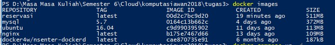
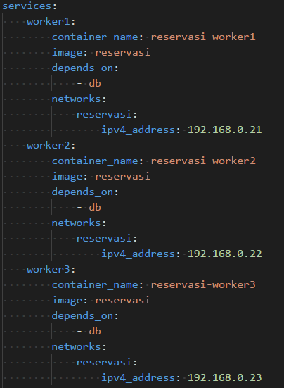
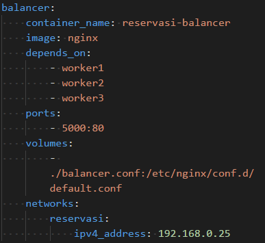
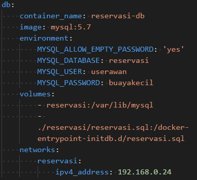
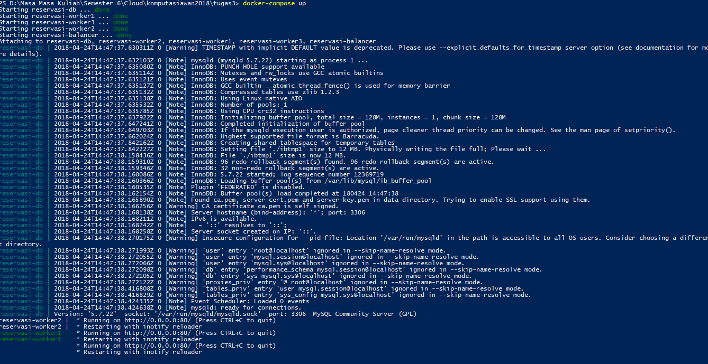
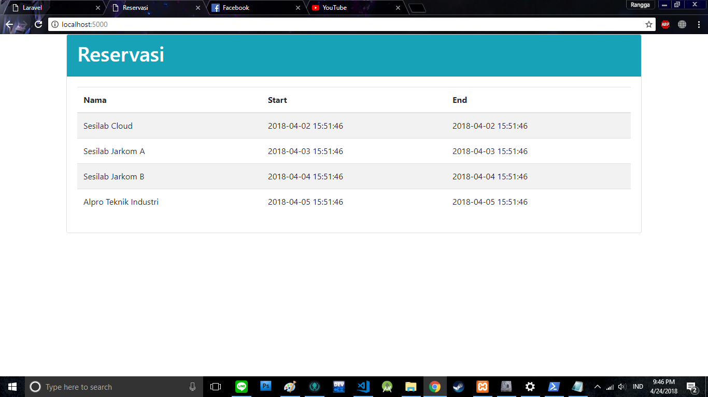

# Docker


## Tugas

	[Soal 1] Configure Dockerfile

1. Buat Dockerfile

	SOLUSI

```bash
nano Dockerfile
FROM ubuntu:16.04
RUN apt-get update && apt-get -y install python-pip libmysqlclient-dev
RUN pip install --upgrade pip
ENV DB_HOST=192.168.0.24 \
    DB_NAME=reservasi \
    DB_USERNAME=userawan \
    DB_PASSWORD=buayakecil
COPY reservasi /reservasi
WORKDIR /reservasi
RUN pip install -r requirements.txt
ENTRYPOINT ["python"]
CMD ["server.py"]
```
2. Lakukan build docker reservasi

SOLUSI
```bash
docker build -t reservasi .
```


	[Soal 2] Buat 3 buah worker dengan menggunakan image yang dibuat pada soal 1.


	[Soal 3] Load Balancer buat Worker.


	[Soal 4] Configure database MySQL.



	[HASIL] Jalankan "docker-compose up"


	Hasilnya

