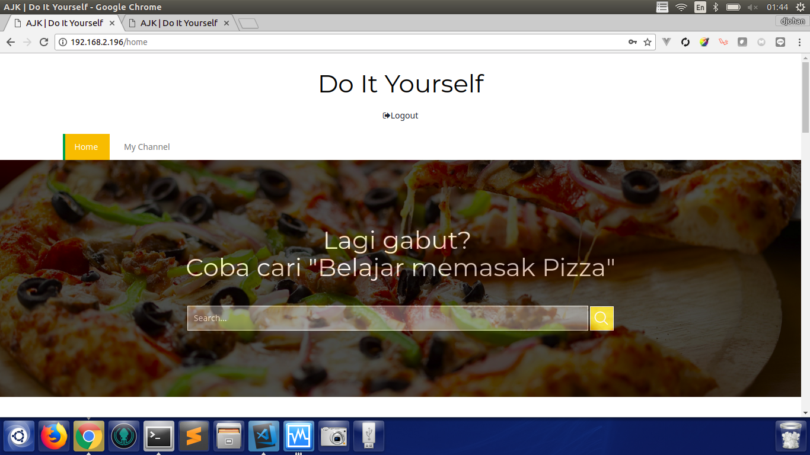
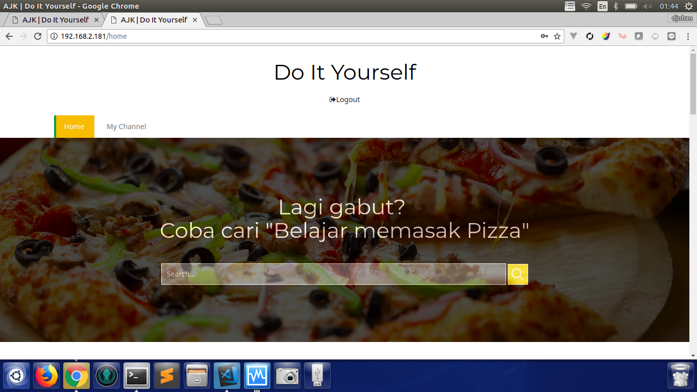

## Tugas Ansible

### Penyelesaian Tugas Ansible

## Soal

1. Buat 3 VM, 2 Ubuntu 16.04 sebagai worker, 1 Debian 9 sebagai DB server
2. Pada vm Debian install Mysql dan setup agar koneksi DB bisa diremote dan memiliki user:
    username: regal
    password: bolaubi

3. Pada worker:
    2.1. Install Nginx
    2,2, Install PHP 7.2
    2.3. Install composer
    2.4. Install Git

    dan pastikan worker dapat menjalankan Laravel 5.6
    
4. Clone [https://github.com/udinIMM/Hackathon](https://github.com/udinIMM/Hackathon) pada setiap worker dan setup database pada .env mengarah ke DB server.

5. Setup root directory nginx ke folder Laravel hasil clone repo diatas

### 1. Setting hosts
```
[worker]
worker1 ansible_host=192.168.2.196 ansible_ssh_user=cloud ansible_become_pass=raincloud123!
worker2 ansible_host=192.168.2.181 ansible_ssh_user=cloud ansible_become_pass=raincloud123!

[database]
database1 ansible_host=192.168.2.169 ansible_ssh_user=regal ansible_become_pass=bolaubi

```

### 2. Install Nginx, Git, dan Curl pada Worker
```
  - hosts: worker
    tasks:
      - name: Install git-nginx-curl
        become: yes #untuk menjadi superuser
        apt: name={{ item }} state=latest update_cache=true
        with_items:
          - nginx
          - git
          - curl

```
```sh
ansible-playbook -i hosts git-nginx-curl.yml -k
```

### 3. Install PHP 7.2
```
  - hosts: worker
    tasks:
      - name: PHP | Install Ondrej PHP PPA
        become: yes #untuk menjadi superuser
        apt_repository: repo='ppa:ondrej/php' update_cache=yes
      - name: PHP | Install PHP 7.2
        become: yes #untuk menjadi superuser
        apt: pkg=php7.2 state=latest
        tags: ['common']

```
```sh
ansible-playbook -i hosts php.yml -k
```

### 4. Install PHP 7.2 Module
```
  - hosts: worker
    tasks:
      - name: PHP | Install PHP Modules
        become: yes #untuk menjadi superuser
        apt: pkg={{ item }} state=latest
        tags: common       
        with_items:
          - php7.2-cli
          - php7.2-curl
          - php7.2-mysql
          - php7.2-fpm
          - php7.2-mbstring
          - php7.2-xml
```
```sh
ansible-playbook -i hosts php-module.yml -k
```

### 5. Install composer
```
  - hosts: worker
    tasks:
      - stat: path=/usr/local/bin/composer
        register: composer_folder
      - name: PHP | Install Composer
        become: yes #untuk menjadi superuser
        shell: curl -sS https://getcomposer.org/installer | php && mv composer.phar /usr/local/bin/composer creates=/usr/local/bin/composer
        when: composer_folder.stat.isdir is not defined
```
```sh
ansible-playbook -i hosts composer.yml -k
```

### 6. Install mysql
```
  - hosts: database
    tasks:
      - name: Install Mysql
        become: yes #untuk menjadi superuser
        become_user: root
        become_method: su
        apt: name={{ item }} state=latest update_cache=false
        with_items:
          - mysql-server
          - python-mysqldb
      - name: Backup my.cnf
        become: yes
        become_user: root
        become_method: su
        shell: mv /etc/mysql/mariadb.conf.d/50-server.cnf /etc/mysql/mariadb.conf.d/50-server.cnf.bak
      - name: Copy File
        become: yes
        become_user: root
        become_method: su
        copy: src=50-server.cnf dest=/etc/mysql/mariadb.conf.d/
      - name: Restart Mysql
        become: yes
        become_user: root
        become_method: su
        shell: /etc/init.d/mysql restart
      - name: Mysql User
        become: yes
        become_user: root
        become_method: su
        mysql_user:
          login_user: root
          login_password: bolaubi
          name: "{{ item.name }}"
          host: "{{ item.host | default('localhost') }}"
          password: bolaubi
          priv: "*.*:ALL,GRANT"
          #priv: "{{ item.priv | default('*.*:ALL,GRANT') | join('/') }}"
          append_privs: "yes"
        with_items:
          - { name: root, host: 192.168.2.202 }
          - { name: root, host: 192.168.2.196 }
          - { name: root, host: 192.168.2.181 }
          #- { name: root, host: 192.168.43.204, priv: '*.*:ALL,GRANT' }
          #- { name: root, host: 192.168.43.162, priv: '*.*:ALL,GRANT' }
          #- { name: root, host: 192.168.43.220, priv: '*.*:ALL,GRANT' }
      - name: Make DB-Table
        become: yes
        become_user: root
        become_method: su
        mysql_db: name=awanku state=present

```
```sh
ansible-playbook -i hosts mysql.yml -k
```

Keterangan :
1. Copy File 50-server.cnf agar databasse bisa diakses dari luar
2. Membuat mysql-user agar user dari ip luar bisa akses database
3. Membuat database dengan nama awanku

### 7. Melakukan Clone Repo dan Install Laravel
```
  - hosts: worker
    tasks:
      - name: Clone Repo
        become: yes 
        shell: git clone https://github.com/udinIMM/Hackathon.git && mv Hackathon /var/www/html && mkdir /var/www/html/Hackathon/vendor
      - name: Copy Folder
        become: yes
        copy: src=vendor/ dest=/var/www/html/Hackathon/vendor
      - name: Copy File
        become: yes
        copy: src=.env dest=/var/www/html/Hackathon
      - name: Composer Update
        become: yes
        shell: cd /var/www/html/Hackathon && php artisan key:generate && chmod -R 777 storage && php artisan migrate:refresh && composer update
```
```sh
ansible-playbook -i hosts clone.yml -k
```
Keterangan:
1. Melakukan copy .env dari computer ke VM dengan setingan DB mengarah ke VM database
2. Membuat table dengan cara php artisan migrate:refresh
3. chmod -R 777 storage agar laravel dapat diakses

### 8. Setting Nginx
```
  - hosts: worker
    tasks:
      - name: Start Nginx
        become: yes 
        shell: service apache2 stop & service nginx restart && mv /etc/nginx/sites-available/default /etc/nginx/sites-available/default.bak
      - name: Copy Setting Load Balancer
        become: yes
        copy: src=default dest=/etc/nginx/sites-available/
      - name: Restart Nginx
        become: yes
        shell: service nginx restart
```
```sh
ansible-playbook -i hosts nginx.yml -k
```
Keterangan :
1. Melakukan copy file default dari PC ke VM

# Hasil
## Worker 1

## Worker 2
